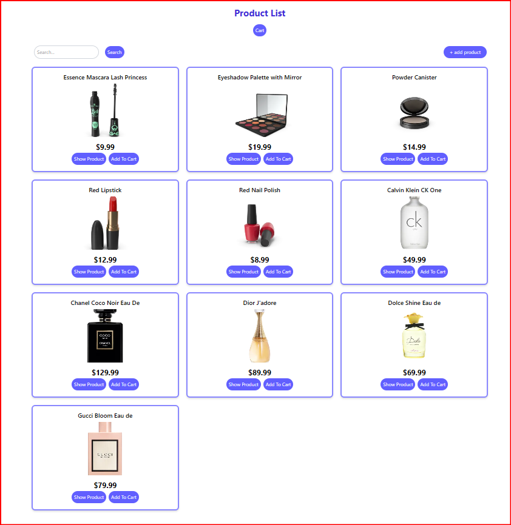
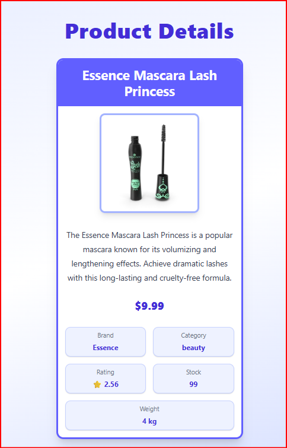
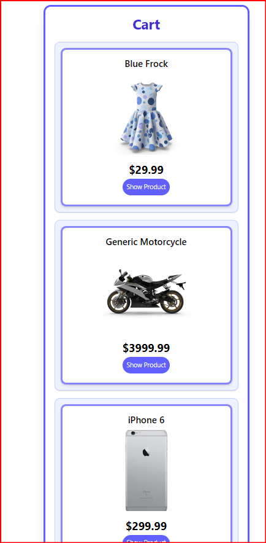
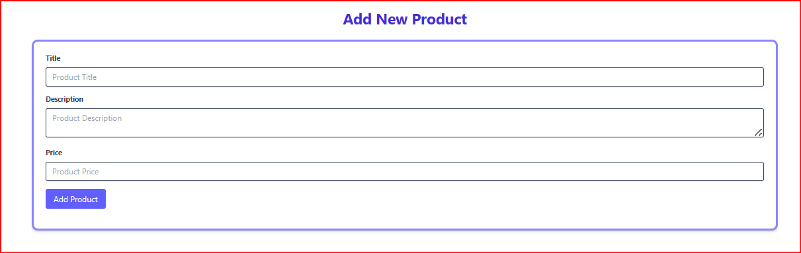
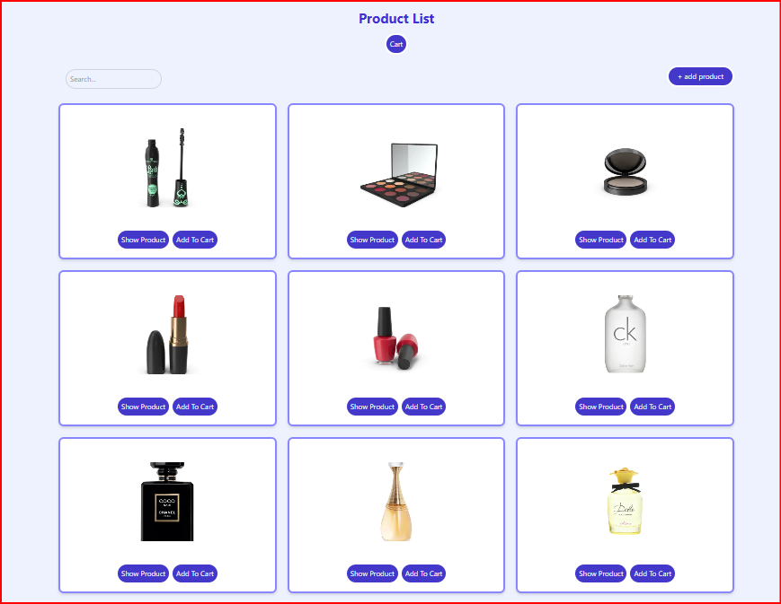
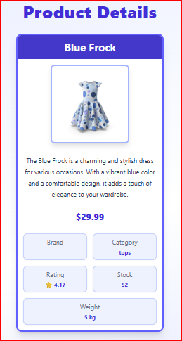
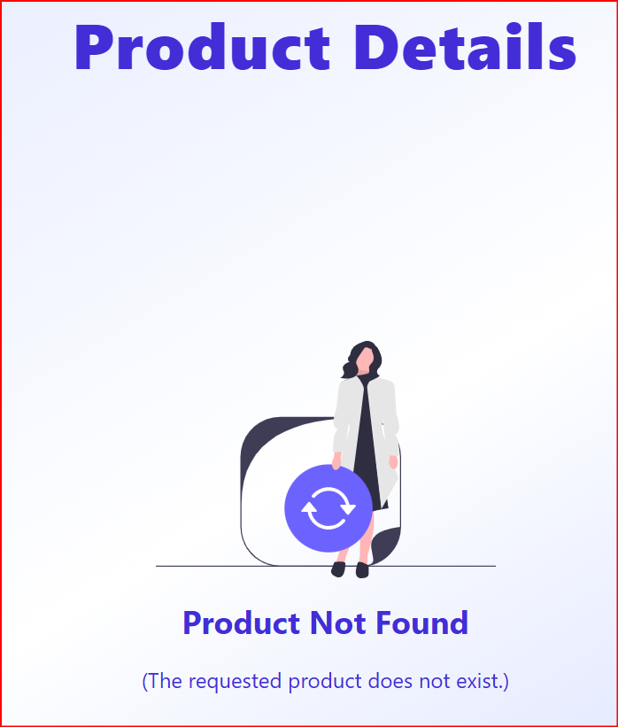
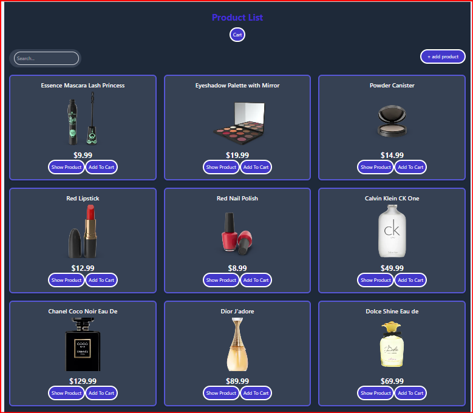
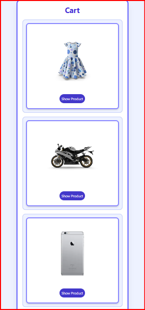
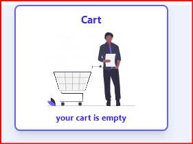

# Product Store

Product Store is a React + Vite frontend that fetches products from a public API, lets users search items, view details, and add products to a cart.

---

## Features

- Product list
- Add product
- Product details page
- Cart page
- Add to cart
- Search products
- Responsive design
- Routing with React Router

---

## Tech Stack

- React
- Vite
- TailwindCSS
- Axios
- React Router

---

## Installation

```bash
npm install
```

---

## Run Project

```bash
npm run dev
```

---

## Project structure
- `src/pages/` - full screens
- `src/components/` - reusable UI pieces
- `src/services/` - API calls

---
## 🎨 UI Improvements

This update includes a complete UI refresh with a consistent design system.

### ✨ Changes made:
- Unified color palette using Indigo theme
- Improved layout spacing and alignment
- Added Dark Mode support
- Better empty states (Cart / Not Found pages)
- Consistent button and input styling

---

## 🌙 Dark Mode

Dark mode can be toggled using the button in the top-right corner.

---

## 📸 Screenshots

### Home Page



### Product Details



### Cart



### Add Product



 ---
 
## 📸 Screenshots after updating


### Product List


### Product Detail


### not found products in cart


### loading


### Dark Mode


### Cart


### Empty State

--- 
